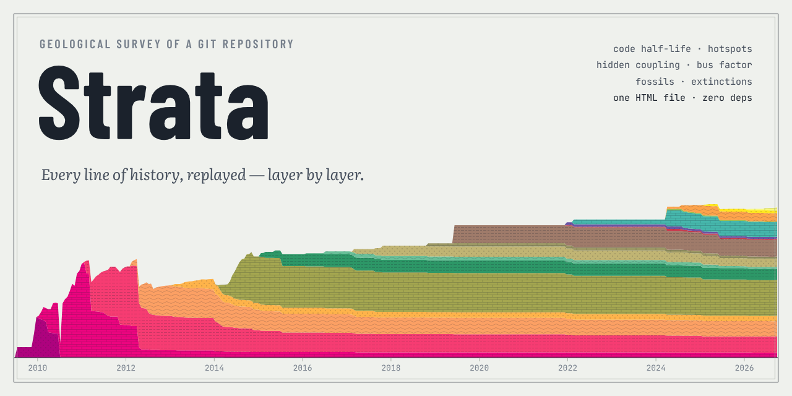

<p align="center"></p>

# Strata

[](https://www.npmjs.com/package/strata-survey) [](LICENSE)

**A geological survey of a git repository.** Strata replays a project's entire history line by line and turns it into one self-contained HTML report. The report shows:

- which layers of code survive and when they were written;
- how fast code decays (its half-life);
- where complexity and churn collide;
- which files are secretly coupled;
- who holds the knowledge.

**[Open a live sample report →](https://mxmvshnvsk.github.io/strata-survey/examples/express.html)** (express, 17 years of history)

```
$ npx strata-survey ~/code/express --open

  STRATIGRAPHY · express
  2026     Quaternary           ██ 583 (2.2%)
  2025     Neogene              ██ 460 (1.7%)
  2024     Paleogene            ██████ 1,488 (5.6%)
  …
  2014     Cambrian             ████████████████████████ 6,400 (23.9%)
  2013     Neoproterozoic       ███ 918 (3.4%)
  2012     Mesoproterozoic      ██████████ 2,718 (10.1%)
  2011     Paleoproterozoic     ███████████ 2,871 (10.7%)
  2010     Archean              ███ 892 (3.3%)
  2009     Hadean               █ 6 (<0.1%)

  FIELD NOTES
  01  17 years of sediment: 5,688 commits by 381 people since Jun 26, 2009. Today it holds 26,798 lines in 214 files.
  04  A line of code here has a half-life of 5 months (source: 4 months, tests: 1.4 years) — half of all
      lines ever written were rewritten or deleted within that time.
  07  Bus factor: 1 person holds more than half of all lines. test is a knowledge silo — Douglas
      Christopher Wilson wrote 61% of it. 94% of the code was written by people inactive for over a year.
  …
```

- **Zero runtime dependencies.** All you need is git and Node 18 or newer.
- **Exact.** The line replay reproduces `git blame --first-parent` line for line (see [Accuracy](#accuracy)).
- **Readable.** Written in strict TypeScript with plain Node and a vanilla SVG client. There is no framework anywhere, and the code is meant to be read: see [Reading the code](#reading-the-code).
- **One file out.** The report is a single HTML file with inline SVG charts. It works offline, adapts to phones and dark mode, and switches between English and Russian.

## Install

Strata is published on npm as [`strata-survey`](https://www.npmjs.com/package/strata-survey). It needs git and Node 18 or newer.

Run it once without installing anything:

```bash
npx strata-survey /path/to/repo --open
```

Or install the `strata` command globally:

```bash
npm install -g strata-survey
strata --version
```

The rest of this README uses `strata`. With `npx`, write `npx strata-survey` instead.

## Usage

Point Strata at any local git repository, or run it inside one:

```bash
cd ~/code/my-project
strata --open                 # survey the current repository, write strata-my-project.html and open it
```

It reads history with ordinary git commands and never changes the repository. A survey takes seconds for most projects and about two minutes for git/git.

### Common recipes

```bash
strata ~/code/app --lang ru                        # report and terminal summary in Russian
strata ~/code/app -o ~/reports/app.html            # choose where the report goes
strata ~/code/app --exclude 'fixtures/**' --exclude '**/*.snap'   # leave out noise
strata ~/code/app --include 'packages/core/**'     # survey one part of a monorepo
strata ~/code/app --no-report                      # terminal summary only
strata ~/code/app --fast                           # huge merge-heavy repo: skip the merge content pass
```

Save the raw survey and render reports from it later, without git or the repository:

```bash
strata ~/code/app --json app.survey.json
strata --from-json app.survey.json --lang ru -o app-ru.html
```

Check how closely the line replay matches `git blame` on your repository:

```bash
strata verify ~/code/app              # 60 random files
strata verify ~/code/app --files 200  # a bigger sample
```

### Options

| Option | What it does |
|---|---|
| `-o, --out <file>` | report path (default `strata-<repo>.html` in the current folder) |
| `--lang en\|ru` | language of the report and of the terminal summary (the report also has an EN/RU switch) |
| `--json <file>` | also save the raw survey as JSON |
| `--from-json <file>` | render a report from a saved survey; no git needed |
| `--exclude <glob>`, `--include <glob>` | narrow the survey (repeatable), e.g. `--exclude 'fixtures/**'` |
| `--no-default-excludes` | keep lockfiles, vendored, generated and minified files, and `.po` catalogs |
| `--name <name>` | display name for the repository |
| `--fast` | skip the content pass that credits merged lines to side-branch authors |
| `--open` | open the report in the default browser when done |
| `--no-report` | print the terminal summary only |
| `-q, --quiet` | no progress output |

Run `strata --help` for the full list.

### Tips

- **Use a full clone.** In a shallow clone (`git clone --depth …`, common in CI) everything older than the first available commit is squashed into the bottom layer. Strata warns about it; run `git fetch --unshallow` first.
- **The report is just a file.** Send it to a colleague, attach it to a ticket or put it on any static host. It loads nothing from the network.
- **Lockfiles and vendored code are excluded by default**, because a 30,000-line lockfile is not code. Use `--no-default-excludes` to keep them.
- **Author names** are merged by name and email and respect the repository's `.mailmap`. If one person still shows up twice, add a `.mailmap` entry.

## Run from source

```bash
git clone https://github.com/mxmvshnvsk/strata-survey.git
cd strata-survey
node bin/strata.ts /path/to/repo --open   # Node 22.18+ runs the TypeScript sources directly
```

On older Node versions (18+), build the JavaScript once:

```bash
npm install                               # installs TypeScript and builds dist/
node dist/bin/strata.js /path/to/repo --open
```

To get a global `strata` command from your checkout, run `npm install && npm link`.

## Examples

Open a live sample report in your browser:

| Report | What to look at |
|---|---|
| [**express**](https://mxmvshnvsk.github.io/strata-survey/examples/express.html) | *Layers by author*: the project changing hands from TJ Holowaychuk to Douglas Wilson |
| [**flask**](https://mxmvshnvsk.github.io/strata-survey/examples/flask.html) | Long-lived maintenance branches and a mass reformatting |
| [**vite**](https://mxmvshnvsk.github.io/strata-survey/examples/vite.html) | A young monorepo: half of the code was written in 2024 or later |
| [**git**](https://mxmvshnvsk.github.io/strata-survey/examples/git.html) | 21 years, 75k commits; the oldest fossil is a 2005 line by Linus Torvalds |

The files themselves are in [`examples/`](examples).

## What the report shows

| Plate | What it answers |
|---|---|
| **Stratigraphic column** + **field notes** | How old is the code alive today? A time scrubber (▶) replays how the column grew and eroded. Ten auto-written findings sit next to it. |
| **I · Stratigraphy** | Every living line over time, coloured by the period it was written in. Switch to *layers by author* to watch ownership change hands, or pick a single module. |
| **II · Geological map** | A zoomable treemap of all files, coloured by median line age, hotspot score, owner, knowledge at risk or recent change. Click a file to drill a *borehole*: you get its core sample (age layers), stats, owners and the files that usually change with it. |
| **III · Half-life** | Kaplan–Meier survival of lines, overall and for source, tests, docs and config. |
| **IV · Hotspots** | Change frequency × indentation complexity. The upper right corner is where to refactor first. |
| **V · Fault lines** | Temporal coupling between modules (chord ring) and between files (pairs table). |
| **VI · Knowledge & bus factor** | Who wrote today's lines in each module, bus factor, and the share written by people inactive for over a year. |
| **VII · Fossil record** | The oldest non-trivial lines still untouched at HEAD. |
| **VIII · Extinctions & big bangs** | Commits that deleted the most old code, and commits that added the most at once. |
| **IX · Seismograph** | Weekly commit trace and monthly active people. |

Strata are coloured with the official ICS chronostratigraphic palette. The oldest layer gets Hadean magenta and the topsoil Quaternary yellow.

## How it works

Strata reads every commit's graph data with `git log --numstat`. It then walks the first-parent history with `git log -p -U0`, keeping one array per file with the id of the commit that wrote each line. Hunk headers alone tell which lines die and which are born, so line contents are never stored. Lines that arrive through merges are credited back to the side-branch commits that wrote them. One `git cat-file --batch` pass over HEAD adds sizes, complexity and fossils.

The full walkthrough is in **[docs/GUIDE.md](docs/GUIDE.md)**: the idea, the architecture, the algorithms, the metric definitions and the limitations.

## Accuracy

`strata verify` checks every text file's replayed length at HEAD against the real file. It also compares the commit and the author of each line, for a sample of files, with `git blame`.

| Repository | Commits | Files with wrong length | Commit per line vs `blame --first-parent` | Author per line vs `blame` | …if merges were credited to the merger |
|---|---:|---:|---:|---:|---:|
| expressjs/express | 6.2k | 0 / 214 | 100.000% | 98.5% | 81.4% |
| psf/requests | 6.5k | 0 / 122 | 100.000% | 98.4% | 62.0% |
| jqlang/jq | 2.0k | 0 / 396 | 100.000% | 99.8% | 98.7% |
| tj/commander.js | 1.5k | 0 / 215 | 99.982% ¹ | 99.6% | 95.1% |
| vitejs/vite | 9.7k | 0 / 2721 | 100.000% | 99.0% | 97.5% |
| pallets/flask | 5.6k | 0 / 230 | 100.000% | 85.0% | 70.6% |
| git/git | 75k | 0 / 4782 | 100.000% | 95.5% | 10.1% |

¹ Two lines in byte-identical files where blame credits a different copy of the same content.

Survey time on a 2-vCPU machine:

| Repository | Time |
|---|---:|
| express | 2.6 s |
| flask | 3.2 s |
| vite | 13 s |
| git/git (1.7M lines, 75k commits) | about 2 minutes (75 s with `--fast`) |

## Project layout

```
bin/strata.ts               entry point
src/cli.ts                  argument parsing, terminal summary, `verify` output
src/types.ts                every shared type, ending with the `Survey` the report is drawn from
src/git.ts                  streaming git runner, cat-file batch, path unquoting, pinned diff config
src/filters.ts              default excludes, globs, file roles (source, tests, docs, config)
src/history.ts              pass 1: commit graph, identities, first-parent chain, side commits
src/patch-parser.ts         streaming parser for `git log -p -U0` / `git diff-tree` output
src/replay.ts               pass 2: the line replay, strata snapshots, deaths, moves in merges
src/mergeblame.ts           content-level credit for merged lines
src/headscan.ts             HEAD blobs: LOC, indentation complexity, fossils
src/survival.ts             Kaplan–Meier estimator
src/period.ts               strata width: years, quarters or months
src/paths.ts                time-aware rename resolution, adaptive modules
src/coupling.ts             temporal coupling (files and modules)
src/analyze.ts              orchestration and all aggregate analyses → Survey
src/narrative.ts            findings as structured facts
src/i18n.ts                 EN/RU templates, plurals, ICS palette (shared by CLI and report)
src/verify.ts               replay vs git blame
src/report/render.ts        builds the single HTML file
src/report/template.html    page layout and styles
src/report/client/*.ts      browser code: one file per group of plates
test/                       unit tests, replay-vs-blame integration, edge cases
examples/                   sample reports
docs/GUIDE.md               idea, architecture, algorithms, metrics, limitations
```

## Reading the code

A good order for a first read:

1. **`src/types.ts`.** The shape of everything Strata produces. `Survey` at the end is the whole result.
2. **`src/patch-parser.ts` → `src/replay.ts`.** The core idea in about 750 lines: hunk headers alone are enough to replay every line's life. Start at `Replay.run` and `Replay.applyFile`.
3. **`src/analyze.ts`.** How the passes are wired together (`prepare`, then `survey`), and how each plate's numbers are computed from the replay.
4. **`src/mergeblame.ts`.** The most intricate part: crediting merged lines back to the side-branch commits that wrote them.
5. **`src/report/client/`.** Start at `main.ts`; each other file draws one or a few plates.

Every file opens with a comment that says what it does and why.

## Development

```bash
npm install          # TypeScript + @types/node; also builds dist/
npm test             # 18 tests, a few seconds (runs the .ts files directly, Node 22.18+)
npm run typecheck    # tsc --noEmit, strict
npm run build        # compile to dist/ for older Node versions and for npm
```

The sources use only *erasable* TypeScript (no enums, namespaces or parameter properties), so Node can run them as they are. The browser code is bundled the simplest possible way: `render.ts` strips the types, drops `import`/`export`, and concatenates the client files into one script inside the page.

## Origin

Strata started as an open-ended overnight experiment: Claude (Anthropic) was given a free evening and a sandbox folder, and this is what it built.

## License

[MIT](LICENSE)
