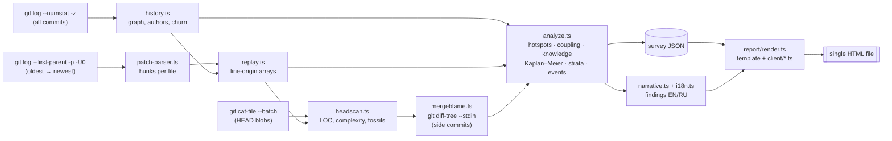

# Strata guide

This guide covers why Strata exists, what questions it answers, how to read the report, and how it works inside. For installation and options, see the [README](../README.md).

## The idea

`git blame` tells you who last touched each line, but only for one moment: now. Strata turns that snapshot into a film.

1. Every line of code is born in some commit and, sooner or later, dies when it is changed or deleted.
2. Walk the history from the first commit to the last. For every file, keep an array that records who wrote each line and when. The result is the full biography of the code. Each array is a drill core, and each year is a sedimentary layer.
3. The metaphor of geology follows naturally: stratigraphy, half-life, extinctions, fossils, faults. The layers use the **official palette of the International Chronostratigraphic Chart (ICS)**. The oldest layer gets Hadean magenta and the topsoil Quaternary yellow. When there are more layers than periods, they are subdivided the way geologists do it (*Early / Late Devonian*).

The key technical trick is that **line contents are not needed**. The hunk headers of `git log -p -U0` (`@@ -a,b +c,d @@`) say exactly which lines died and how many were born. The replay is therefore fast and light on memory. At HEAD it **matches `git blame --first-parent` line for line**. This was verified on seven real repositories, including git itself.

## What it is for

| Who | Question | Where to look |
|---|---|---|
| Tech lead | Where should refactoring effort go? | Hotspots: change frequency × complexity |
| Tech lead | Where does the architecture lie? | Fault lines: modules that change together although they should not |
| Manager | What happens if a key person leaves? | Bus factor per module, knowledge silos, share of code by inactive authors |
| Newcomer | Which parts are the ancient core and which are recent additions? | Geological map in *age* mode |
| OSS maintainer | Is the project alive, and who carries it? | Seismograph, stratigraphy by author |
| Everyone | How stable is our code? | Half-life of source vs tests vs docs |
| Retrospectives | What happened here in 2014? | Fossils, extinctions, big bangs |

Some findings from real projects:

- **express.** The *layers by author* view shows the project changing hands: code by TJ Holowaychuk (2009–2014) is gradually replaced by code by Douglas Wilson. Today 94% of the code was written by people who have been inactive for more than a year, and the bus factor is 1.
- **git.** 21 years of history. The oldest fossil is a line Linus Torvalds wrote in the README on 7 April 2005, explaining the name: *"random three-letter combination that is pronounceable…"*. Half-life is 17 years; this is measured at the integration level, and code inside topic branches lives much shorter. The bus factor is 14.
- **vite.** Half of the code was written in 2024 or later. Tests outlive source code: 3.5 years against 1.4 years.

## Reading the report

The report is laid out like a geological survey sheet: a title cartouche with metadata, then the column and field notes, then nine plates.

1. **Stratigraphic column.**
   - Shows the code alive today, sorted by the year it was written: oldest at the bottom, newest on top.
   - The thickness of a layer is its number of living lines.
   - A layer with no surviving lines is drawn as a wavy line, which geologists call an *unconformity*.
   - The time scrubber and the ▶ button replay how the column grew and eroded.
2. **Field notes.** Ten automatically written findings.
3. **I · Stratigraphy.** How layers grew and eroded over time. A layer that keeps its thickness is bedrock. The *by author* switch shows ownership changing hands. You can also focus on a single module.
4. **II · Geological map.**
   - A treemap of all files, sized by lines.
   - Colour can show the age of a file's median line, hotspot score, owner, knowledge at risk or recent change.
   - Click a folder to zoom in. Click a file to drill a *borehole*: a panel with the file's core sample (its own age layers), stats, owners, and the files that usually change together with it. These files are links.
   - A search box above the map finds files by path.
5. **III · Half-life.** Kaplan–Meier survival curves of lines, separately for source, tests, docs and config.
6. **IV · Hotspots.** A log-log scatter of change frequency against complexity. The upper right corner holds the refactoring candidates.
7. **V · Fault lines.** A ring of links between modules and a table of the most coupled file pairs. Links that cross a module boundary are highlighted.
8. **VI · Knowledge & bus factor.** Module owners, bus factor (a red **1** is a warning) and the share of code by inactive authors.
9. **VII · Fossil record.** The oldest non-trivial lines that survived unchanged to this day.
10. **VIII · Extinctions & big bangs.** Commits that removed the most old code, and commits that brought the most new code.
11. **IX · Seismograph.** Weekly commits drawn as a seismic trace, plus active people per month.

The report works on phones and in dark mode. It needs no server: every chart is drawn as SVG from JSON embedded in the page.

## Architecture

The pipeline has six stages:

1. **Commit graph** (`history.ts`). One streaming `git log --numstat -z` gives parents, timestamps, mailmapped authors and per-file churn for every commit. Identities that share a name or an email are merged with union-find, and bots are flagged. The first-parent chain is extracted, and every merge gets the list of side-branch commits it brought in.
2. **Line replay** (`patch-parser.ts` + `replay.ts`, the heart of the system). `PatchParser` turns the patch stream into per-file hunk lists without keeping line text (except inside merges, where the text is needed to detect moves). For each commit on the first-parent chain, the file's hunks are applied in reverse order with `splice`. Removed lines are *deaths*: their age goes into weekly bins for the survival curve. New lines get the current commit's origin. Running tallies of living lines per layer, per author and per module are kept, and 320 snapshots of them are taken over the history.
3. **HEAD scan** (`headscan.ts`). A single `git cat-file --batch` reads every text file at HEAD. It measures lines and indentation complexity, cross-checks each file's replayed length against the real one, and digs up fossils.
4. **Merge attribution** (`replay.ts` + `mergeblame.ts`). See below.
5. **Analyses** (`analyze.ts`, `coupling.ts`, `paths.ts`). Hotspots, temporal coupling, adaptive modules, bus factor, Kaplan–Meier (`survival.ts`), extinctions, activity. Everything ends up in one `Survey` object, typed in `types.ts`, which is also what `--json` writes.
6. **Report** (`narrative.ts`, `i18n.ts`, `report/`). Findings are stored as structured facts and rendered in English or Russian, both in the terminal and in the page. The browser code (`report/client/*.ts`) is vanilla TypeScript that draws SVG; there is no framework and no CDN. `render.ts` strips the types and concatenates the client files into one inline script.

### The code in types

The data flow is easiest to follow through the types in `src/types.ts`:

- `Commit` and `Person` come out of pass 1 (`readHistory`, `resolveIdentities`).
- The replay works with `OriginId`s. An origin says who wrote a line and when: an author, a time, the first-parent commit that brought it in and, for merged lines, the side-branch commit credited. Lines that share an origin share one id, so a file is just an array of small integers. `Replay` keeps origins in parallel arrays (`oAt`, `oAuthor`, `oCommit`, `oSide`) rather than objects, which keeps memory small even on git/git (1.7M living lines).
- `FileDiff` and `Hunk` (`patch-parser.ts`) are the only view of a commit the replay needs.
- Everything the report shows is in `Survey`: `Strata`, `Survival`, `FileReport`, `Hotspot`, `CouplingReport`, `ModuleReport`, `PersonReport`, `Fossil`, `CommitEvent`, `Pulse` and the `Fact`s of the narrative.

### Merges in three steps

A merge diff against its first parent looks as if whoever pressed *Merge* wrote all the merged code. Strata corrects this in three steps:

1. **Heuristic.** Each file is first credited to the side-branch commit that changed it most.
2. **Moves.** Text that the merge deletes in one place and re-adds in another keeps its original author and date. It moved; nobody wrote it again.
3. **Content pass** (`mergeblame.ts`).
   - Only the side commits behind surviving lines are read, all in one `git diff-tree --stdin` call.
   - Each line is credited to the latest side commit that added exactly that text to the same file.
   - Short lines (braces, blank lines) prove nothing by their text, so they follow their neighbours.

Each step adds accuracy, and `strata verify` measures the result. On requests, crediting merged lines to whoever merged them matches plain `git blame` authorship for 62% of lines. With all three steps it matches 98.4%.

### Algorithms and metrics

- **Half-life.** The median of the Kaplan–Meier survival estimate for individual lines. A modified line counts as one death plus one birth. Lines still alive are censored observations ("lived at least X"), so young code does not drag the estimate down.
- **Hotspots.** Adam Tornhill's method: change frequency × indentation complexity, both on a log scale. The score is `log(1+changes)/log(1+max) × log(1+complexity)/log(1+max)`. Frequency uses the last 12 months, or the whole history if the project is quiet. Only source and test files are ranked.
- **Temporal coupling.** The code-maat metric: `shared commits / mean(revisions of a, revisions of b)`, with at least 5 shared commits. Mass commits that touch more than 30 files are ignored as noise. The borehole panel uses confidence instead: the share of this file's commits that also touched the partner.
- **Bus factor.** The smallest number of people (bots excluded) who together wrote more than half of the lines in a module or in the repository.
- **At risk.** The share of lines whose author has not committed for a year before HEAD.
- **Adaptive modules.** The largest folder is split into subfolders while there are at most 32 modules. If a folder has too many subfolders, the big ones become modules and the small ones fold back into the parent.
- **Time-aware renames.** If `a.js` was renamed to `b.js` in 2015 and a new `a.js` appeared in 2018, the new file's history does not stick to `b.js`.

### Robustness

All of the following cases are handled and covered by tests:

- **Your `~/.gitconfig`.** Settings such as `diff.noprefix` or `diff.interHunkContext` would break the replay, so every option that shapes diff output is pinned.
- **File names:** spaces, non-ASCII characters, quotes, and names that contain ` and `.
- **File contents:**
  - files without a trailing newline, and empty files;
  - files that switch between binary and text;
  - files marked `-diff` in `.gitattributes` (Strata diffs them itself);
  - files moved in from excluded folders, including pure renames.
- **Special git objects:** symlinks (also through renames) and submodules.
- **Commit metadata:** control characters in commit messages, and commits whose clock is set in the future.
- **Shallow clones** are flagged in both the report and the terminal.
- **Report safety.** Every repository-controlled string is escaped, and the embedded JSON escapes `<`. Template placeholders are substituted in a single pass, so a commit message that reads `{{CLIENT}}` cannot break the page.
- **Speed.** Excluded paths are filtered in JavaScript. Git pathspecs are used only when excluded files carry heavy churn, because glob pathspecs make `git log` up to 6× slower.

Edge cases found during two independent reviews are pinned down by regression tests in `test/edge.test.ts`.

## Accuracy

`strata verify <repo>` runs three checks:

- It compares the replayed length of every text file at HEAD with the real file.
- For a sample of files, it compares the commit credited for each line with `git blame --first-parent`.
- It compares the author of each line with plain `git blame`, which follows merges into side branches.

| Repository | Commits | Files with wrong length | Commit per line vs `blame --first-parent` | Author per line vs `blame` | …if merges were credited to the merger |
|---|---:|---:|---:|---:|---:|
| expressjs/express | 6.2k | 0 / 214 | 100.000% | 98.5% | 81.4% |
| psf/requests | 6.5k | 0 / 122 | 100.000% | 98.4% | 62.0% |
| jqlang/jq | 2.0k | 0 / 396 | 100.000% | 99.8% | 98.7% |
| tj/commander.js | 1.5k | 0 / 215 | 99.982% ¹ | 99.6% | 95.1% |
| vitejs/vite | 9.7k | 0 / 2721 | 100.000% | 99.0% | 97.5% |
| pallets/flask | 5.6k | 0 / 230 | 100.000% | 85.0% | 70.6% |
| git/git | 75k | 0 / 4782 | 100.000% | 95.5% | 10.1% |

¹ Two lines in byte-identical fixture files where blame picks a different copy of the same content.

Flask scores lower because it uses long-lived maintenance branches with mass reformatting. Plain blame follows those changes through renames inside side branches, which a first-parent replay cannot see.

## Limitations

- **Integration level only.** Survival and half-life are measured on the first-parent history. Lines that were born and died inside a topic branch before merging are invisible. In merge-based workflows such as git's own, this makes half-lives longer.
- **No move detection inside ordinary commits.** Reformatting or moving a block inside an ordinary commit counts as new lines, exactly like `git blame` without `-M/-C`. Moves inside merges are the exception.
- **Reconstructed merge authorship.** Who wrote merged lines is very accurate in practice, but it is not a full blame over the whole commit graph.
- **Coarse complexity.** Indentation complexity is a language-agnostic proxy, not cyclomatic complexity.
- **Large monorepos.** They work, but a survey takes minutes and the report can reach a few megabytes.

## Ideas for the future

- **`strata diff A..B`:** how the geology changed over a release.
- **CI mode:** fail when a key module's bus factor drops to 1 or a hotspot heats up.
- **Full file biography:** the borehole shows the core at HEAD; per-file snapshots could show its whole history.
- **Era detection:** split the history into eras automatically, based on changes in the core authors.
- **Repository comparison:** several repositories on one half-life scale.
